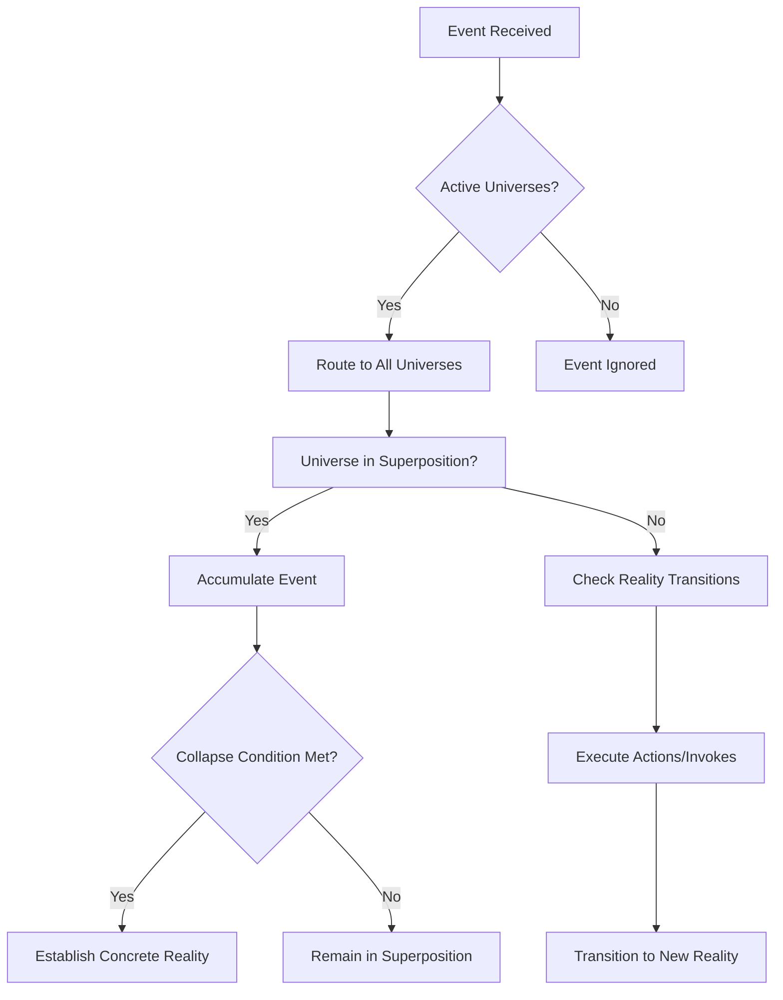

# StatePro

> ⚡ **Quantum State Machines for Go** - Model complex workflows with multi-universe superposition

StatePro is a powerful Go library for building **multi-universe state machines** that react to "quantum" events. It decouples declarative JSON models from a sophisticated execution engine that understands superposition, event observation, and universal constants.

## What is StatePro?

StatePro takes traditional state machines to the next level by introducing **quantum superposition** - the ability to have multiple parallel "universes" (workflows) active simultaneously. Unlike traditional state machines that are limited to a single active state, StatePro can handle complex scenarios where:

- Multiple workflows run in parallel
- Events are accumulated until conditions are met
- Workflows can spawn new parallel universes
- States collapse from superposition into concrete realities



[](https://pkg.go.dev/github.com/rendis/statepro/v3)
[](https://go.dev/)
[](https://www.gnu.org/licenses/gpl-3.0)
[](https://github.com/rendis/statepro/actions/workflows/github-code-scanning/codeql)
[](https://github.com/rendis/statepro/security/dependabot)

## ✨ Key Features

- 🌌 **Multi-Universe Architecture** - Build complex workflows by composing multiple parallel state machines (universes) that can interact and spawn new workflows
- 🔄 **Quantum Superposition** - Handle scenarios where multiple states are possible simultaneously, accumulating events until conditions determine the final outcome
- 📋 **Declarative JSON Models** - Define entire workflows using simple JSON - no complex code needed for transitions, guards, actions, and metadata
- 🎯 **Event-Driven Runtime** - React to events with sophisticated routing, allowing multiple workflows to process the same event in parallel
- 🔧 **Extensible Registry System** - Easily add custom business logic through observers (guards), actions (sync operations), and invokes (async operations)
- 🐛 **Rich Debugging Tools** - Interactive CLI debugger, automated testing bot, and detailed execution snapshots for troubleshooting
- 📊 **Runtime Introspection** - Full visibility into machine state, execution history, and accumulated events for monitoring and debugging

## 🚀 Quick Start

Get up and running with StatePro in 5 simple steps:

1. **📄 Create JSON Definition** - Define your workflow in JSON
2. **🔧 Register Custom Logic** *(optional)* - Add business-specific actions and observers
3. **📥 Load and Parse** - Deserialize the JSON model
4. **⚙️ Initialize Machine** - Create and start the quantum machine
5. **🎯 Send Events** - Interact with your workflow by sending events

### Step 1: Create a Simple Workflow

Create `workflow.json`:

<details>
<summary>Click to expand workflow.json</summary>

```json
{
  "id": "user-signup",
  "initials": ["U:signup-process"],
  "universes": {
    "signup-process": {
      "initial": "COLLECTING_INFO",
      "realities": {
        "COLLECTING_INFO": {
          "type": "transition",
          "on": {
            "submit": [{"targets": ["VERIFYING_EMAIL"]}]
          }
        },
        "VERIFYING_EMAIL": {
          "type": "transition",
          "on": {
            "verify": [{"targets": ["COMPLETED"]}],
            "timeout": [{"targets": ["EXPIRED"]}]
          }
        },
        "COMPLETED": {
          "type": "final"
        },
        "EXPIRED": {
          "type": "unsuccessfulFinal"
        }
      }
    }
  }
}
```

</details>

### Step 2: Create the Go Application

Create `main.go`:

```go
package main

import (
    "context"
    "log"
    "os"

    "github.com/rendis/statepro/v3"
)

func main() {
    // Load the workflow definition
    raw, err := os.ReadFile("workflow.json")
    if err != nil {
        log.Fatal("Error reading workflow:", err)
    }

    // Parse the JSON into a model
    model, err := statepro.DeserializeQuantumMachineFromBinary(raw)
    if err != nil {
        log.Fatal("Error parsing model:", err)
    }

    // Create the quantum machine
    qm, err := statepro.NewQuantumMachine(model)
    if err != nil {
        log.Fatal("Error creating machine:", err)
    }

    // Initialize with context (can be any Go value)
    ctx := context.Background()
    userCtx := map[string]any{"userId": "user123"}
    if err := qm.Init(ctx, userCtx); err != nil {
        log.Fatal("Error initializing:", err)
    }

    // Send an event
    event := statepro.NewEventBuilder("submit").
        SetData(map[string]any{"email": "user@example.com"}).
        Build()

    handled, err := qm.SendEvent(ctx, event)
    if err != nil {
        log.Fatal("Error sending event:", err)
    }

    if handled {
        log.Println("✅ Event processed successfully")
    } else {
        log.Println("⚠️  Event was ignored (no matching transitions)")
    }

    // Check current state
    snapshot := qm.GetSnapshot()
    resume := snapshot.GetResume()
    log.Printf("Active workflows: %v", resume.ActiveUniverses)
}
```

### Step 3: Run It

```bash
go mod init quickstart
go mod edit -require github.com/rendis/statepro/v3@v3.0.0
go mod tidy
go run main.go
```

**Expected Output:**

```plaintext
✅ Event processed successfully
Active workflows: map[signup-process:[VERIFYING_EMAIL]]
```

### What's Happening?

- **Universe**: `signup-process` represents the entire signup workflow
- **Realities**: `COLLECTING_INFO` → `VERIFYING_EMAIL` → `COMPLETED`
- **Event**: `submit` triggers the transition from collecting to verifying
- **Snapshot**: Shows the current active state of all workflows

Try sending more events like `verify` or `timeout` to see the workflow complete!

## 🛠️ Examples & Tooling

StatePro includes several example implementations to help you get started:

### Live Examples

```bash
# 📊 Basic state machine execution with tracking
go run example/sm

# 🎮 Interactive Bubble Tea debugger
go run example/cli

# 🤖 Automated event playback and testing
go run example/bot
```

### Example Files

- **`example/sm/`** - Complete admission workflow with custom actions
- **`example/cli/`** - Interactive debugging with real JSON definitions
- **`example/bot/`** - Deterministic event automation for testing

Each example includes well-documented JSON state machine definitions and Go code demonstrating different StatePro features.

## Installation

```bash
go get github.com/rendis/statepro/v3
```

Go 1.22 or newer is required.

## ❓ Frequently Asked Questions

### What makes StatePro "quantum"?

StatePro uses **superposition** to handle complex workflows where multiple outcomes are possible simultaneously. Traditional state machines can only be in one state at a time, but StatePro can accumulate events across multiple potential states until conditions determine the final path.

### When should I use StatePro vs traditional state machines?

Use StatePro when you need:

- **Parallel workflows** that run simultaneously
- **Event accumulation** (waiting for multiple conditions)
- **Dynamic spawning** of new workflows
- **Complex business processes** with many interacting components

### How does it compare to workflow engines like Temporal or Conductor?

StatePro focuses on **declarative state management** with quantum superposition, while traditional workflow engines emphasize orchestration and retries. StatePro is ideal for **business logic modeling** where you need to track complex state interactions.

### Can I use StatePro in production?

Yes! StatePro is designed for production use with:

- Full snapshot and recovery capabilities
- Comprehensive error handling
- Performance optimizations for high-throughput scenarios
- Rich debugging and monitoring tools

### How do I handle errors and retries?

Use **unsuccessful final states** for failures and **observers** for retry logic. Actions can return errors to prevent invalid transitions, and invokes handle async operations with proper error logging.

## 🏗️ Common Patterns

### User Onboarding Flow

A multi-step process with parallel tasks and conditional logic:

<details>
<summary>Click to expand user onboarding example</summary>

```json
{
  "id": "user-onboarding",
  "initials": ["U:registration"],
  "universes": {
    "registration": {
      "initial": "COLLECTING_INFO",
      "realities": {
        "COLLECTING_INFO": {
          "type": "transition",
          "on": {
            "submit": [{"targets": ["U:email-verification", "U:account-setup"]}]
          }
        }
      }
    },
    "email-verification": {
      "initial": "SENDING_EMAIL",
      "realities": {
        "SENDING_EMAIL": {
          "type": "transition",
          "always": [{"targets": ["WAITING_VERIFICATION"]}],
          "entryActions": [{"src": "action:sendVerificationEmail"}]
        },
        "WAITING_VERIFICATION": {
          "type": "transition",
          "on": {
            "verify": [{"targets": ["VERIFIED"]}],
            "timeout": [{"targets": ["EXPIRED"]}]
          }
        },
        "VERIFIED": {"type": "final"},
        "EXPIRED": {"type": "unsuccessfulFinal"}
      }
    },
    "account-setup": {
      "realities": {
        "WAITING_COMPLETION": {
          "type": "final",
          "observers": [{
            "src": "observer:emailVerified"
          }]
        }
      }
    }
  }
}
```

</details>

### Order Processing with Saga Pattern

Handle distributed transactions with compensation:

<details>
<summary>Click to expand order processing example</summary>

```json
{
  "id": "order-processing",
  "initials": ["U:order-validation"],
  "universes": {
    "order-validation": {
      "initial": "VALIDATING",
      "realities": {
        "VALIDATING": {
          "type": "transition",
          "always": [{"targets": ["U:payment-processing", "U:inventory-check"]}]
        }
      }
    },
    "payment-processing": {
      "initial": "PROCESSING_PAYMENT",
      "realities": {
        "PROCESSING_PAYMENT": {
          "type": "transition",
          "on": {
            "payment.success": [{"targets": ["PAYMENT_COMPLETED"]}],
            "payment.failed": [{"targets": ["PAYMENT_FAILED"]}]
          }
        },
        "PAYMENT_COMPLETED": {"type": "final"},
        "PAYMENT_FAILED": {
          "type": "unsuccessfulFinal",
          "entryActions": [{"src": "action:initiateRefund"}]
        }
      }
    },
    "inventory-check": {
      "realities": {
        "CHECKING_STOCK": {
          "type": "final",
          "observers": [{
            "src": "observer:inventoryAvailable"
          }]
        }
      }
    }
  }
}
```

</details>

### Event-Driven Microservices

Coordinate multiple services through events:

<details>
<summary>Click to expand microservices example</summary>

```json
{
  "id": "service-coordination",
  "initials": ["U:request-handler"],
  "universes": {
    "request-handler": {
      "initial": "PROCESSING",
      "realities": {
        "PROCESSING": {
          "type": "transition",
          "always": [{"targets": ["U:user-service", "U:notification-service"]}]
        }
      }
    },
    "user-service": {
      "realities": {
        "WAITING_RESPONSE": {
          "type": "final",
          "observers": [{
            "src": "observer:userEventReceived",
            "args": {"expectedEvent": "user.updated"}
          }]
        }
      }
    },
    "notification-service": {
      "realities": {
        "WAITING_RESPONSE": {
          "type": "final",
          "observers": [{
            "src": "observer:notificationEventReceived",
            "args": {"expectedEvent": "notification.sent"}
          }]
        }
      }
    }
  }
}
```

</details>

## 📋 Machine Definition Example

StatePro uses pure JSON to define quantum state machines. Here's a simplified admission workflow that demonstrates the core concepts:

```jsonc
{
  "id": "admission",                                    // 🆔 Unique machine identifier
  "initials": ["U:admission-in-waiting-confirmation"], // 🚀 Starting universes
  "universes": {
    "admission-in-waiting-confirmation": {              // 🌌 Universe definition
      "initial": "CREATED",                             // 📍 Starting state
      "realities": {                                    // 🎭 Available states
        "CREATED": {
          "type": "transition",
          "always": [{"targets": ["WAITING_CONFIRMATION"]}]
        },
        "WAITING_CONFIRMATION": {                       // ⏳ Await decision
          "type": "transition",
          "on": {
            "confirm": [{"targets": ["CONFIRMED"]}],    // ✅ Accept event
            "reject":  [{"targets": ["U:admission-rejected"]}] // ❌ Reject to new universe
          }
        },
        "CONFIRMED": {                                  // 🎉 Success state
          "type": "final",
          "always": [{"targets": [                      // 🔀 Split into parallel universes
            "U:admission-form-process",
            "U:admission-contract-process"
          ]}]
        }
      }
    }
  }
}
```

> 💡 **Learn More**: See [`docs/modeling.md`](docs/modeling.md) for a complete JSON reference and advanced patterns.

## 📖 Documentation

Comprehensive guides and references are available in the [`docs/`](docs/README.md) directory:

### Core Concepts & Modeling

- 🧠 [**Concepts**](docs/concepts.md) - Fundamental concepts: universes, realities, transitions, superposition, and accumulators
- 📝 [**Modeling Guide**](docs/modeling.md) - Step-by-step instructions for crafting JSON state machine definitions
- 🔄 [**Runtime & Execution**](docs/runtime.md) - Deep dive into initialization, event routing, and snapshot management

### Development & Integration

- ⚙️ [**Instrumentation Reference**](docs/instrumentation.md) - Public interfaces and executor contracts for custom extensions
- 🔧 [**Debugging & Tooling**](docs/debugging.md) - Interactive CLI viewer, automation bot, and logging utilities
- 🤝 [**Contributing Guide**](CONTRIBUTING.md) - How to contribute code, report issues, and help improve StatePro

### Quick Navigation

| Topic | Description | Best For |
|-------|-------------|----------|
| New to StatePro? | Start with [Concepts](docs/concepts.md) | Understanding the fundamentals |
| Building workflows? | Read [Modeling Guide](docs/modeling.md) | Creating JSON definitions |
| Integrating? | Check [Instrumentation](docs/instrumentation.md) | Custom actions & observers |
| Debugging issues? | Use [Debugging Tools](docs/debugging.md) | Troubleshooting workflows |

## 🔧 Development

StatePro uses standard Go tooling for development:

```bash
# Run tests
go test ./...

# Build examples
go build ./example/...

# Check module dependencies
go mod tidy
```

## 📄 License

StatePro is distributed under the terms of the **GNU General Public License v3.0**. See [`LICENSE`](LICENSE) for full details.

---

<div align="center">

**⭐ Found StatePro useful?** Consider starring the repository to show your support!

[](https://github.com/rendis/statepro)

</div>
