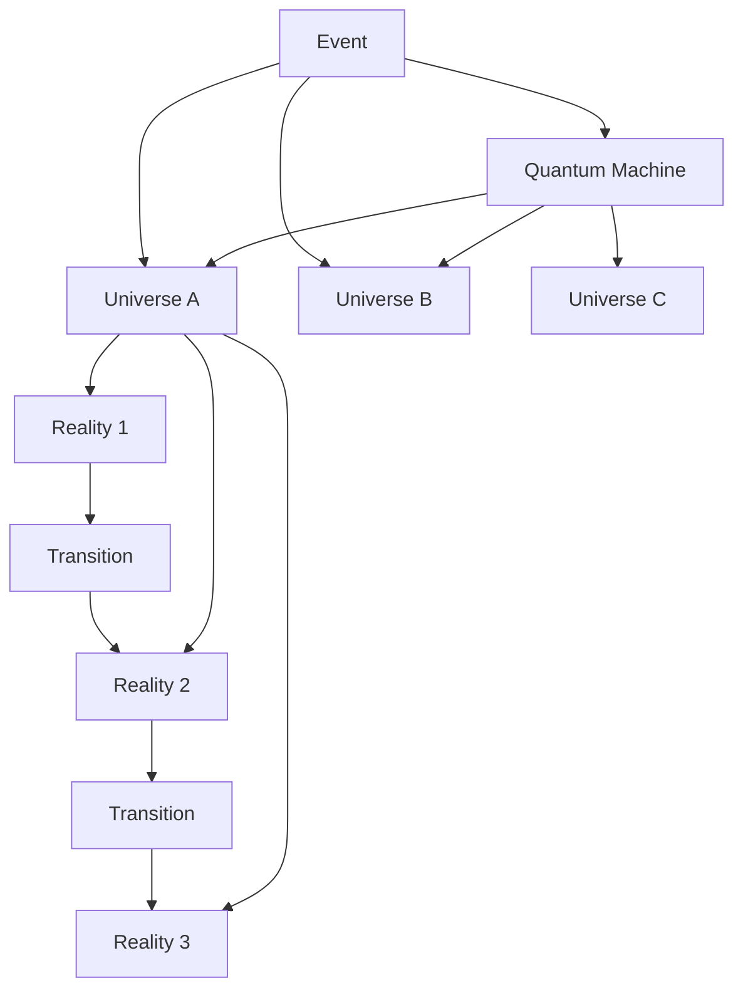
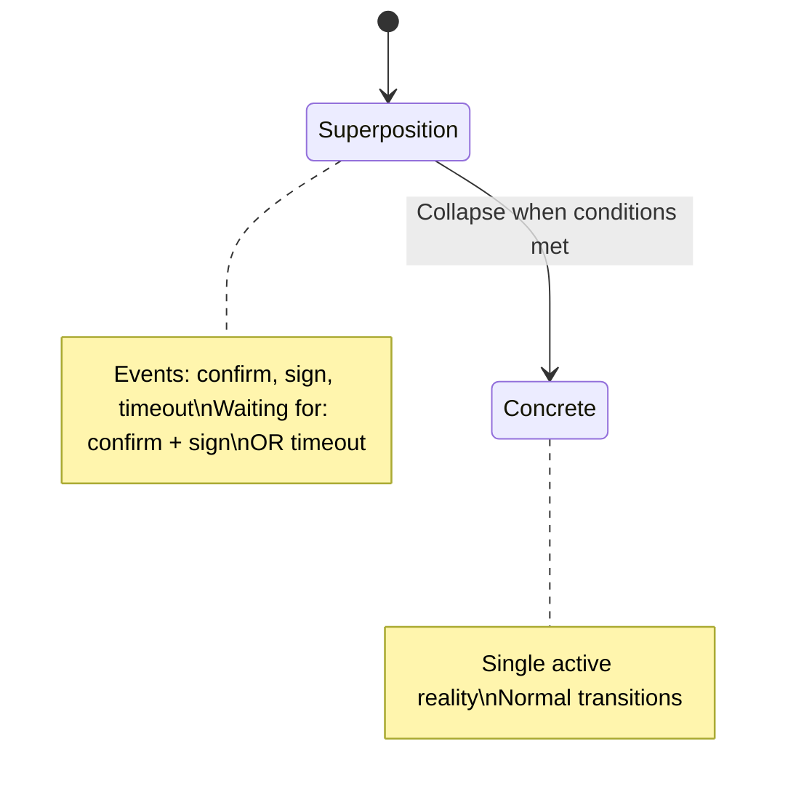

# Core Concepts

StatePro models **quantum machines** composed of multiple universes that react to events. This section explains every structural concept you will use when defining a machine.

## Architecture Overview

## Quantum Machine Model

A `theoretical.QuantumMachineModel` is the root document that you serialize to JSON.

Key properties:

- `id`, `canonicalName`, `version`: unique identifiers and versioning metadata.
- `initials`: list of references describing how to boot the machine. References follow these forms:
  - `U:<universeID>` — start the universe on its configured initial reality or superposition.
  - `U:<universeID>:<realityID>` — start the universe directly on a specific reality.
- `universes`: map of universe definitions (see below).
- `universalConstants` (optional): operations that wrap every universe regardless of which one is
  currently active.
- `metadata` (optional): machine-level key/value map forwarded to executors.

## Universes

A universe represents a cohesive state machine with its own realities, constants, and metadata.

Important fields in `theoretical.UniverseModel`:

- `id`, `canonicalName`, `version`: identifiers and immutable grouping key.
- `initial` (optional): reality ID to use when the universe first starts. If omitted, the universe
  enters superposition until a reality is established.
- `realities`: map of `RealityModel` objects.
- `universalConstants` (optional): universe-specific hooks for entry/exit and transitions.
- `metadata`, `tags` (optional): arbitrary data that executors can mutate using metadata helpers.

Universes can transition between each other by referencing `U:<targetUniverse>` or
`U:<targetUniverse>:<reality>` in transitions.

## Realities

A `theoretical.RealityModel` is a node inside a universe. Each reality defines:

- `id`: unique within the universe.
- `type`: one of `transition`, `final`, `unsuccessfulFinal`.
  - Transition realities accept incoming events and may transition elsewhere.
  - Final realities mark the universe as completed in a success state.
  - Unsuccessful final realities mark the universe as finished due to failure.
- `always` (optional): transitions executed immediately when the reality is established.
- `on` (optional): event-driven transitions keyed by event name.
- `observers` (optional): guard conditions evaluated before a reality processes an event.
- `entryActions`, `exitActions`: synchronous operations executed when entering/exiting the reality.
- `entryInvokes`, `exitInvokes`: asynchronous fire-and-forget callbacks for enter/exit.
- `metadata` (optional): per-reality context merged into universe metadata.
- `description`: human-readable explanation.

## Transitions

`theoretical.TransitionModel` describes how to move from one reality to another.

Components:

- `targets`: required list of destination identifiers. Targets may point to realities in the same
  universe (`REALITY_ID`), other universes (`U:universe`), or specific realities elsewhere
  (`U:universe:reality`).
- `type`: defaults to `default`. When set to `notify`, the current reality remains active while
  notifying external universes.
- `condition` / `conditions`: optional guard(s) using registered condition executors.
- `actions`: synchronous steps triggered when the transition fires.
- `invokes`: asynchronous calls triggered when the transition fires.
- `description`, `metadata`: optional documentation and data.

Transitions defined inside `always` arrays run in declaration order. The first transition that returns
`true` halts the rest.

## Observers

Observers watch accumulated events while a reality is active. They implement
`instrumentation.ObserverFn` and receive statistics from the accumulator.

If any observer returns `true`, the transition it guards may proceed. Observers run in parallel; as
soon as one succeeds, others stop.

## Actions and Invokes

Both actions and invokes reference executors by `src` strings. You can register implementations via
`builtin.RegisterAction`, `RegisterInvoke`, or provide your own registry. Actions run synchronously and
may cancel the transition by returning an error. Invokes run asynchronously and do not influence flow.

## Universal Constants

Universal constants apply to either the machine or a specific universe.

They provide hooks for:

- Entry actions/invokes executed when a reality starts.
- Exit actions/invokes executed when a reality finishes.
- Transition actions/invokes executed whenever any transition fires.

Machine-level constants run first, followed by universe-level constants.

## Superposition

Superposition occurs when a universe has no single active reality. This can happen when:

- The universe is initialized without an `initial` reality.
- An `always` transition or external target sends the universe into a pending state.
- Observers require additional events before choosing a reality.

While in superposition:

- Events are accumulated per candidate reality.
- Observers and conditions examine accumulated events to determine when a collapse should happen.
- Once a transition succeeds, the universe establishes a concrete reality and exits superposition.

## Superposition in Action

## Accumulators

The event accumulator captures the history of events received while in superposition. The default implementation (`experimental.eventAccumulator`) tracks:

- Total events per reality.
- Distinct event names per reality.
- The chronological list of events for analytics.

Executors access statistics through `instrumentation.AccumulatorStatistics`, enabling custom logic such as "wait until both `confirm` and `sign` are present".

## Metadata and Tracking

Universes keep a mutable metadata map. Executors can add, update, or delete keys through helper
methods on their argument objects. The experimental runtime also maintains a `tracking` slice that
records every reality the universe has visited; snapshots expose this information for diagnostics.

## Putting It All Together

A quantum machine definition connects universes with transitions and observers. Events flow through
active universes, optionally spawn new universes, and eventually settle into final states. Superposition
and accumulators ensure that complex multi-step requirements can be expressed without losing the
history of incoming events.
