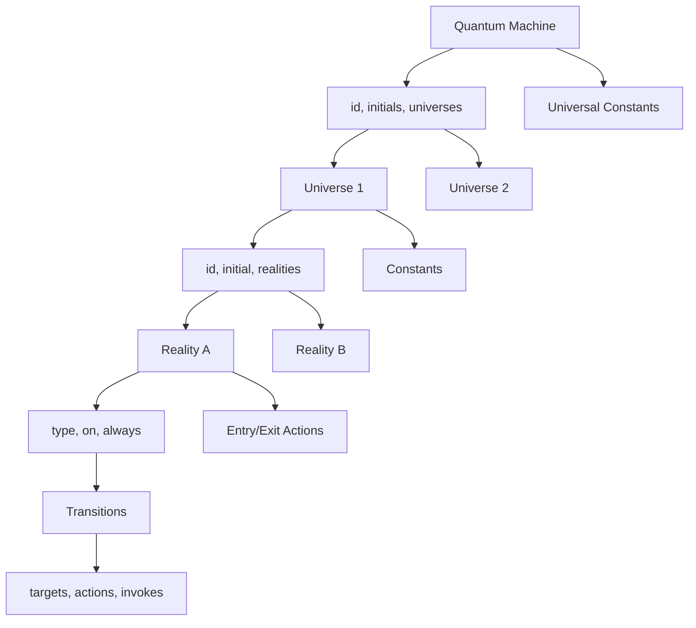

# Modeling Guide

This guide walks you through defining a quantum machine model and serializing it to JSON. For a
complete schema reference see `theoretical/*` source files.

## Prerequisites

- Go 1.22 or later.
- A clear understanding of the business process you want to model.
- Unique identifiers for your machine, universes, and realities (letters, numbers, `_`, `-`).

## Workflow Overview

1. **Draft the machine metadata**: pick `id`, `canonicalName`, `version`, and machine-level constants.
2. **List universes**: each encapsulates a flow. Decide whether it has an `initial` reality.
3. **Describe realities**: choose the `type`, observers, and transitions reacting to events.
4. **Wire transitions**: define targets, optional conditions, and synchronous/asynchronous logic.
5. **Register executors**: connect actions, observers, invokes, and conditions via registries.
6. **Serialize and ship**: load JSON into Go using `statepro.DeserializeQuantumMachineFromBinary` and
   create a runtime with `statepro.NewQuantumMachine`.

## JSON Structure Primer



| Element | Location | Key Fields |
|---------|----------|------------|
| Machine | root | `id`, `canonicalName`, `version`, `initials`, `universes`, `universalConstants` |
| Universe | `universes.<key>` | `id`, `canonicalName`, `version`, `initial`, `realities`, `metadata` |
| Reality | `universes.<key>.realities.<key>` | `type`, `always`, `on`, `observers`, `entryActions`, `exitActions` |
| Transition | `always[]` or `on.<event>[]` | `targets`, `type`, `conditions`, `actions`, `invokes` |
| Executor reference | `actions[]`, `invokes[]`, `observers[]`, `conditions[]` | `src`, `args`, `description` |
| Universal constants | machine or universe level | `entryActions`, `exitActions`, `invokesOnTransition`, etc. |

Referential rules:

- Transition targets must reference existing universes or realities.
- References use `U:<universe>` or `U:<universe>:<reality>` for cross-universe jumps.
- Reality IDs must be unique within their universe.

## Step-by-Step Example

The snippet below shows selected fragments from `example/sm/state_machine.json`. Comments explain
what each section does (remove them in real JSON files).

```jsonc
{
  "id": "admission",
  "canonicalName": "admission-machine",
  "version": "0.1.0",
  "initials": ["U:admission-in-waiting-confirmation"],
  "universes": {
    "admission-in-waiting-confirmation": {
      "id": "admission-in-waiting-confirmation",
      "canonicalName": "admission-in-waiting-confirmation",
      "version": "0.1.0",
      "initial": "CREATED",
      "realities": {
        "CREATED": {
          "type": "transition",
          "always": [
            { "targets": ["WAITING_CONFIRMATION"] }
          ]
        },
        "WAITING_CONFIRMATION": {
          "type": "transition",
          "on": {
            "confirm": [
              { "targets": ["CONFIRMED"] }
            ],
            "reject": [
              { "targets": ["U:admission-rejected"] }
            ]
          }
        },
        "CONFIRMED": {
          "type": "final",
          "always": [
            {
              "targets": [
                "U:admission-form-process",
                "U:admission-contract-process"
              ]
            }
          ]
        }
      }
    },
    "admission-waiting-processes": {
      "id": "admission-waiting-processes",
      "version": "0.1.0",
      "realities": {
        "WAITING_PROCESSES": {
          "type": "final",
          "observers": [
            {
              "src": "builtin:observer:containsAllEvents",
              "args": {"p1": "fill-form", "p2": "sign"}
            }
          ],
          "always": [
            {
              "targets": [
                "U:admission-contract-process:SIGNING_ENROLLMENT_CONTRACT"
              ]
            }
          ]
        }
      }
    }
  },
  "universalConstants": {
    "entryActions": [
      {"src": "builtin:action:logBasicInfo"}
    ],
    "actionsOnTransition": [
      {"src": "builtin:action:logArgs"}
    ]
  }
}
```

Highlights:

- The machine starts a single universe (`admission-in-waiting-confirmation`).
- The `CONFIRMED` final reality spawns additional universes via its `always` transition.
- Observers in `admission-waiting-processes` wait until all required events accumulate before
  notifying another universe.
- Universal constants ensure every entry and transition logs information without duplicating logic.

## Validating Your Model

1. Use `SerializeQuantumMachineToMap`/`SerializeQuantumMachineToBinary` to serialize structs you build
   in code.
2. Call `statepro.NewQuantumMachine` to ensure the model is structurally correct; this validates
   references and required fields.
3. Write unit tests that load your JSON and attempt to initialize the runtime with representative
   contexts and events.

## Loading and Running in Go

```go
raw, _ := os.ReadFile("state_machine.json")
model, _ := statepro.DeserializeQuantumMachineFromBinary(raw)
qm, _ := statepro.NewQuantumMachine(model)

ctx := context.Background()
machineCtx := &AdmissionCtx{Active: true}
_ = qm.Init(ctx, machineCtx) // or qm.InitWithEvent(...)

handled, err := qm.SendEvent(ctx, statepro.NewEventBuilder("confirm").Build())
if err != nil {
    // handle runtime errors from actions/conditions
}
if !handled {
    // the event did not match any active reality
}
```

## Next Steps

- Dive into [concepts](concepts.md) for an exhaustive description of each field.
- Learn how the runtime interprets your JSON in [runtime.md](runtime.md).
- Register custom behaviour using the contracts described in
  [instrumentation.md](instrumentation.md).
